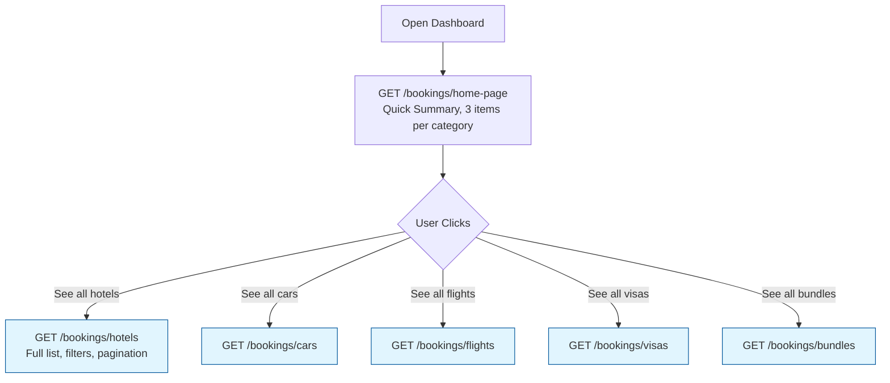

Here is the formatted version of your API documentation, structured for clarity and ease of use by Flutter developers.

---

# Trip Mate — Office Dashboard Bookings API

> **For Flutter developers (office/admin dashboard).** All endpoints require a Bearer token.
>
> **Base URL:** `http://<HOST>/bookings`
> ```
> Authorization: Bearer <access_token>
> ```

---

## Dashboard Flow

This API is designed to match the natural navigation flow of your dashboard.



> ⚠️ **Note:** The `find-all` endpoints (e.g., `GET /bookings/hotels`) return the **full details** for every item. You typically won't need the `find-one` endpoints unless you only have a `bookingId` (e.g., from a deep link).

---

## Table of Contents

- [1. Home Page](#1-home-page)
- [2. All Hotel Bookings](#2-all-hotel-bookings)
- [3. All Car Bookings](#3-all-car-bookings)
- [4. All Flight Bookings](#4-all-flight-bookings)
- [5. All Visa Bookings](#5-all-visa-bookings)
- [6. All Bundle Bookings](#6-all-bundle-bookings)
- [7. Find One — When to Use It](#7-find-one--when-to-use-it)
- [8. Shared Reference](#8-shared-reference)
    - [Booking Status Values](#booking-status-values)
    - [Paginated Response Shape](#paginated-response-shape)
    - [Error Responses](#error-responses)

---

## 1. Home Page

Returns the **3 most recent** bookings of each category as lightweight summary cards — ideal for the dashboard overview screen.

- **Endpoint:** `GET /bookings/home-page`

**Query Parameters**

| Parameter | Type | Required | Notes |
|---|---|---|---|
| `arrivalCountry` | string | ❌ | Filters all categories by destination country (e.g., `UAE`). |

**Example Request**
```
GET /bookings/home-page?arrivalCountry=UAE
```

**Success Response `200`**
```json
{
  "message": "Home page bookings retrieved successfully",
  "data": {
    "bundles": [
      {
        "type": "BUNDLE",
        "id": "42",
        "name": "Ahmed Ali",
        "createdAt": "2026-04-01T10:00:00.000Z"
      }
    ],
    "hotels": [
      {
        "bookingId": "15",
        "type": "HOTEL",
        "name": "Sara Omar",
        "createdAt": "2026-04-01T09:00:00.000Z",
        "destinationCountry": "UAE",
        "rate": 4,
        "numberOfGuests": 3
      }
    ],
    "cars": [
      {
        "bookingId": "22",
        "type": "CAR",
        "name": "Khalid Hassan",
        "createdAt": "2026-04-01T08:00:00.000Z",
        "destinationCountry": "UAE"
      }
    ],
    "visas": [
      {
        "bookingId": "8",
        "type": "VISA",
        "name": "Hana Yousef",
        "createdAt": "2026-04-01T07:00:00.000Z",
        "destinationCountry": "UAE",
        "numberOfPassengers": 2,
        "visaType": "Tourist"
      }
    ],
    "flights": [
      {
        "bookingId": "31",
        "type": "FLIGHT",
        "name": "Omar Nasser",
        "createdAt": "2026-04-01T06:00:00.000Z",
        "destinationCountry": "UAE",
        "destinationCity": "Dubai",
        "numberOfPassengers": 3
      }
    ]
  }
}
```

> **Note:** This response is a summary. Use the find-all endpoints below to get full booking details.

---

## 2. All Hotel Bookings

> ✅ **Response includes full booking details + user info.** No need to call find-one after this.

- **Endpoint:** `GET /bookings/hotels`

**Query Parameters**

| Parameter | Type | Required | Default | Notes |
|---|---|---|---|---|
| `page` | integer | ❌ | `1` | Page number for pagination. |
| `limit` | integer | ❌ | `10` | Number of items per page (Max `100`). |
| `arrivalCountry` | string | ❌ | — | Filter by destination country. |
| `status` | string | ❌ | — | Filter by booking status. See [values](#booking-status-values). |
| `sortBy` | string | ❌ | `createdAt` | Field to sort by (only `createdAt`). |
| `sortOrder` | string | ❌ | `DESC` | Sort order: `ASC` or `DESC`. |

**Example Request**
```
GET /bookings/hotels?page=1&limit=10&arrivalCountry=UAE&status=WAITING_FOR_OFFERS
```

**Success Response `200`**
```json
{
  "message": "Hotel bookings retrieved successfully",
  "data": {
    "data": [
      {
        "bookingId": "15",
        "booking": {
          "id": "15",
          "user": {
            "accountId": "3",
            "name": "Sara Omar",
            "account": {
              "email": "sara@example.com",
              "phone": "+962791234567",
              "status": "ACTIVE"
            }
          },
          "type": "HOTEL",
          "status": "WAITING_FOR_OFFERS",
          "createdAt": "2026-04-01T09:00:00.000Z",
          "updatedAt": "2026-04-01T09:00:00.000Z"
        },
        "destinationCountry": "UAE",
        "destinationCity": "Dubai",
        "isTherePreferredHotel": true,
        "hotelName": "Marriott Dubai",
        "starRating": 5,
        "checkIn": "2026-04-10T00:00:00.000Z",
        "checkOut": "2026-04-17T00:00:00.000Z",
        "numGuests": 2,
        "numChildren": 1,
        "roomDetails": [
          {
            "roomType": "Suite",
            "accommodationType": "King"
          }
        ],
        "notes": "High floor preferred"
      }
    ],
    "total": 25,
    "page": 1,
    "limit": 10,
    "totalPages": 3
  }
}
```

---

## 3. All Car Bookings

> ✅ **Response includes full booking details + user info.** No need to call find-one after this.

- **Endpoint:** `GET /bookings/cars`

**Query Parameters**

| Parameter | Type | Required | Default | Notes |
|---|---|---|---|---|
| `page` | integer | ❌ | `1` | Page number for pagination. |
| `limit` | integer | ❌ | `10` | Number of items per page (Max `100`). |
| `arrivalCountry` | string | ❌ | — | Filter by destination country. |
| `arrivalCity` | string | ❌ | — | Filter by destination city. |
| `status` | string | ❌ | — | Filter by booking status. See [values](#booking-status-values). |
| `sortBy` | string | ❌ | `createdAt` | Field to sort by (only `createdAt`). |
| `sortOrder` | string | ❌ | `DESC` | Sort order: `ASC` or `DESC`. |

**Example Request**
```
GET /bookings/cars?page=1&limit=10&arrivalCountry=UAE&arrivalCity=Dubai
```

**Success Response `200`**
```json
{
  "message": "Car bookings retrieved successfully",
  "data": {
    "data": [
      {
        "bookingId": "22",
        "booking": {
          "id": "22",
          "user": {
            "accountId": "5",
            "name": "Khalid Hassan",
            "account": {
              "email": "khalid@example.com",
              "phone": "+962799876543",
              "status": "ACTIVE"
            }
          },
          "type": "CAR",
          "status": "WAITING_FOR_OFFERS",
          "createdAt": "2026-04-01T08:00:00.000Z",
          "updatedAt": "2026-04-01T08:00:00.000Z"
        },
        "arrivalCountry": "UAE",
        "arrivalCity": "Dubai",
        "deliveryLocation": "Dubai Airport T3",
        "deliveryDate": "2026-04-10T10:00:00.000Z",
        "returnDate": "2026-04-17T10:00:00.000Z",
        "carType": "SUV",
        "transmissionType": "Automatic",
        "carBrand": "Toyota",
        "carModel": "Fortuner",
        "hasDrivingLicense": true,
        "driverAge": 30,
        "drivingExperienceYears": 5,
        "requiresPrivateDriver": false,
        "requiresChildSeat": true,
        "requiresFullInsurance": true,
        "notes": ""
      }
    ],
    "total": 12,
    "page": 1,
    "limit": 10,
    "totalPages": 2
  }
}
```

---

## 4. All Flight Bookings

> ✅ **Response includes full booking details + user info.** No need to call find-one after this.

- **Endpoint:** `GET /bookings/flights`

**Query Parameters**

| Parameter | Type | Required | Default | Notes |
|---|---|---|---|---|
| `page` | integer | ❌ | `1` | Page number for pagination. |
| `limit` | integer | ❌ | `10` | Number of items per page (Max `100`). |
| `arrivalCountry` | string | ❌ | — | Filter by destination country. |
| `status` | string | ❌ | — | Filter by booking status. See [values](#booking-status-values). |
| `sortBy` | string | ❌ | `createdAt` | Field to sort by (only `createdAt`). |
| `sortOrder` | string | ❌ | `DESC` | Sort order: `ASC` or `DESC`. |

**Example Request**
```
GET /bookings/flights?page=1&limit=10&arrivalCountry=UAE
```

**Success Response `200`**
```json
{
  "message": "Flight bookings retrieved successfully",
  "data": {
    "data": [
      {
        "bookingId": "31",
        "booking": {
          "id": "31",
          "user": {
            "accountId": "7",
            "name": "Omar Nasser",
            "account": {
              "email": "omar@example.com",
              "phone": "+962795551234",
              "status": "ACTIVE"
            }
          },
          "type": "FLIGHT",
          "status": "WAITING_FOR_OFFERS",
          "createdAt": "2026-04-01T06:00:00.000Z",
          "updatedAt": "2026-04-01T06:00:00.000Z"
        },
        "departureCountry": "Jordan",
        "departureCity": "Amman",
        "arrivalCountry": "UAE",
        "arrivalCity": "Dubai",
        "isRoundTrip": true,
        "departureDate": "2026-04-10T08:00:00.000Z",
        "returnDate": "2026-04-17T18:00:00.000Z",
        "hasVisa": false,
        "hasCompanions": true,
        "numberOfCompanions": 2,
        "fullName": "Omar Nasser",
        "dateOfBirth": "1990-05-15T00:00:00.000Z",
        "nationalIdNumber": "9876543210",
        "nationality": "Jordanian",
        "hasPassport": true,
        "isYouTravelToThisCountryBefore": false,
        "isYourVisaRefusedBefore": false
      }
    ],
    "total": 18,
    "page": 1,
    "limit": 10,
    "totalPages": 2
  }
}
```

---

## 5. All Visa Bookings

> ✅ **Response includes full booking details + user info.** No need to call find-one after this.

- **Endpoint:** `GET /bookings/visas`

**Query Parameters**

| Parameter | Type | Required | Default | Notes |
|---|---|---|---|---|
| `page` | integer | ❌ | `1` | Page number for pagination. |
| `limit` | integer | ❌ | `10` | Number of items per page (Max `100`). |
| `arrivalCountry` | string | ❌ | — | Filter by destination country. |
| `visaType` | string | ❌ | — | e.g., `Tourist`, `Business`, `Study`. |
| `status` | string | ❌ | — | Filter by booking status. See [values](#booking-status-values). |
| `sortBy` | string | ❌ | `createdAt` | Field to sort by (only `createdAt`). |
| `sortOrder` | string | ❌ | `DESC` | Sort order: `ASC` or `DESC`. |

**Example Request**
```
GET /bookings/visas?page=1&limit=10&visaType=Tourist
```

**Success Response `200`**
```json
{
  "message": "Visa bookings retrieved successfully",
  "data": {
    "data": [
      {
        "bookingId": "8",
        "booking": {
          "id": "8",
          "user": {
            "accountId": "2",
            "name": "Hana Yousef",
            "account": {
              "email": "hana@example.com",
              "phone": "+962798765432",
              "status": "ACTIVE"
            }
          },
          "type": "VISA",
          "status": "WAITING_FOR_OFFERS",
          "createdAt": "2026-04-01T07:00:00.000Z",
          "updatedAt": "2026-04-01T07:00:00.000Z"
        },
        "fingerPrintLocation": "Amman - Abdali Branch",
        "arrivalCountry": "UAE",
        "visaType": "Tourist",
        "departureDate": "2026-04-10T00:00:00.000Z",
        "companionsAdults": 1,
        "companionsChildren": 0
      }
    ],
    "total": 9,
    "page": 1,
    "limit": 10,
    "totalPages": 1
  }
}
```

---

## 6. All Bundle Bookings

> ✅ **Response includes the full bundle with all nested hotel/car/flight/visa details + user info.** No need to call find-one after this.

- **Endpoint:** `GET /bookings/bundles`

**Query Parameters**

| Parameter | Type | Required | Default | Notes |
|---|---|---|---|---|
| `page` | integer | ❌ | `1` | Page number for pagination. |
| `limit` | integer | ❌ | `10` | Number of items per page (Max `100`). |
| `status` | string | ❌ | — | Filters by the status of sub-bookings. See [values](#booking-status-values). |
| `sortBy` | string | ❌ | `createdAt` | Field to sort by (only `createdAt`). |
| `sortOrder` | string | ❌ | `DESC` | Sort order: `ASC` or `DESC`. |

**Example Request**
```
GET /bookings/bundles?page=1&limit=10&status=WAITING_FOR_OFFERS
```

**Success Response `200`**
```json
{
  "message": "Bundle bookings retrieved successfully",
  "data": {
    "data": [
      {
        "id": "42",
        "user": {
          "accountId": "9",
          "name": "Ahmed Ali",
          "account": {
            "email": "ahmed@example.com",
            "phone": "+962791122334",
            "status": "ACTIVE"
          }
        },
        "createdAt": "2026-04-01T10:00:00.000Z",
        "hotels": [
          {
            "bookingId": "43",
            "booking": { "id": "43", "status": "WAITING_FOR_OFFERS" },
            "destinationCountry": "UAE",
            "destinationCity": "Dubai",
            "starRating": 5,
            "checkIn": "2026-04-10T00:00:00.000Z",
            "checkOut": "2026-04-17T00:00:00.000Z",
            "numGuests": 2,
            "numChildren": 0,
            "roomDetails": [{ "roomType": "Suite", "accommodationType": "King" }],
            "notes": ""
          }
        ],
        "flights": [
          {
            "bookingId": "44",
            "booking": { "id": "44", "status": "WAITING_FOR_OFFERS" },
            "departureCountry": "Jordan",
            "departureCity": "Amman",
            "arrivalCountry": "UAE",
            "arrivalCity": "Dubai",
            "isRoundTrip": true,
            "departureDate": "2026-04-10T08:00:00.000Z",
            "returnDate": "2026-04-17T18:00:00.000Z",
            "fullName": "Ahmed Ali",
            "hasVisa": true,
            "hasCompanions": false
          }
        ],
        "cars": [
          {
            "bookingId": "45",
            "booking": { "id": "45", "status": "WAITING_FOR_OFFERS" },
            "arrivalCountry": "UAE",
            "arrivalCity": "Dubai",
            "deliveryLocation": "Dubai Airport T3",
            "carType": "Sedan",
            "transmissionType": "Automatic"
          }
        ],
        "visas": []
      }
    ],
    "total": 5,
    "page": 1,
    "limit": 10,
    "totalPages": 1
  }
}
```

---

## 7. Find One — When to Use It

Since the `find-all` endpoints return **every field**, you only need `find-one` in specific scenarios, such as arriving at a detail screen from a push notification or deep link with only a `bookingId`.

| Endpoint | Method | When to Use |
|---|---|---|
| `GET /bookings/hotels/:bookingId` | GET | Only when you have a `bookingId` but not the full hotel object. |
| `GET /bookings/cars/:bookingId` | GET | Only when you have a `bookingId` but not the full car object. |
| `GET /bookings/flights/:bookingId` | GET | Only when you have a `bookingId` but not the full flight object. |
| `GET /bookings/visas/:bookingId` | GET | Only when you have a `bookingId` but not the full visa object. |
| `GET /bookings/bundle/:id` | GET | Only when you have a `bundleId` but not the full bundle object. |

> All `find-one` endpoints return the **same shape** as the corresponding item inside the `find-all` response.

---

## 8. Shared Reference

### Booking Status Values

| Status | Meaning |
|---|---|
| `DRAFT` | Just created. |
| `WAITING_FOR_OFFERS` | Submitted, waiting for office offers. |
| `UNDER_NEGOTIATION` | Office sent an offer, negotiating. |
| `OFFER_ACCEPTED` | User accepted an offer. |
| `PARTIALLY_PAID` | Partial payment made. |
| `CONFIRMED` | Fully paid and confirmed. |
| `COMPLETED` | Trip completed. |
| `CANCELLED` | Booking cancelled. |

### Paginated Response Shape

All `find-all` endpoints wrap their results in this standard structure:

```json
{
  "message": "...",
  "data": {
    "data": [ ...items ],
    "total": 25,
    "page": 1,
    "limit": 10,
    "totalPages": 3
  }
}
```

### Error Responses

```json
{ "statusCode": 401, "message": "Unauthorized" }
```
```json
{ "statusCode": 400, "message": ["arrivalCountry should not be empty"], "error": "Bad Request" }
```
```json
{ "statusCode": 404, "message": "Bundle not found" }
```